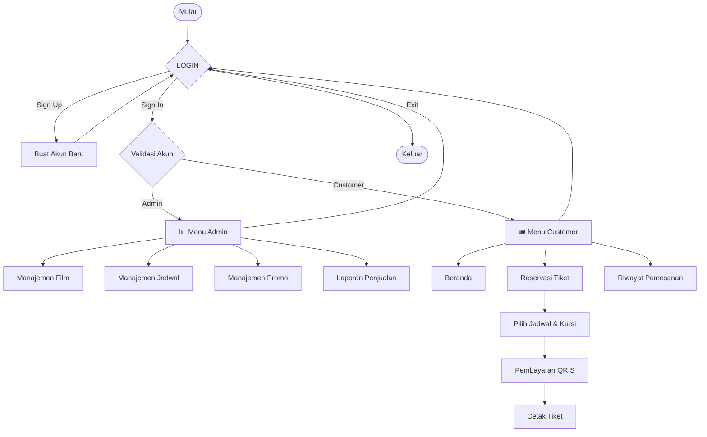

<div align="center">


<br/>


<br/><br/>

# 🎬 CinemaXXV

### Sistem Reservasi Tiket Bioskop — Console App (C++)

<sub>★彡 CONSOLE-BASED CINEMA RESERVATION ENGINE 彡★</sub>

<br/><br/>

<p>
  
  
  
  
</p>
<p>
  
  
  
  
</p>

<br/>

> *"Pesan tiket bioskop favoritmu langsung dari terminal — pilih film, pilih kursi, bayar lewat QRIS, cetak tiket. Semua dari console, semua dalam genggaman keyboard."* 🍿🎬

<br/>

<table width="100%">
<tr>
<td align="center" style="background-color:#0d1117;">

<sub>════════════════════════════════════════════════════════════════</sub>

**✦ CinemaXXV — Where The Terminal Becomes The Big Screen ✦**

<sub>════════════════════════════════════════════════════════════════</sub>

</td>
</tr>
</table>

<br/>

<p>
  <a href="#-pratinjau-tampilan"></a>
  <a href="#%EF%B8%8F-cara-menjalankan"></a>
  <a href="#-fitur-utama"></a>
  <a href="#-anggota-kelompok"></a>
</p>


</div>

---

## 📋 Daftar Isi

- [Tentang Proyek](#-tentang-proyek)
- [Fitur Utama](#-fitur-utama)
- [Alur Aplikasi](#-alur-aplikasi)
- [Struktur Menu](#-struktur-menu)
- [Batasan & Aturan Data](#-batasan--aturan-data)
- [Cara Menjalankan](#-cara-menjalankan)
- [Akun Default](#-akun-default)
- [Pratinjau Tampilan](#-pratinjau-tampilan)
- [Anggota Kelompok](#-anggota-kelompok)

---

## 🎯 Tentang Proyek

**CinemaXXV** adalah sistem reservasi tiket bioskop berbasis **C++ (console application)**. Aplikasi ini mensimulasikan proses bisnis bioskop secara end-to-end: admin mengelola film, jadwal, dan promo, sementara customer bisa memesan tiket, memilih kursi secara visual, membayar dengan QRIS dummy, hingga mencetak tiket dan melihat riwayat pemesanan.

> 💡 **Kenapa menarik?** Semua dikerjakan tanpa database eksternal — murni array & struct di memori, dengan validasi input yang cukup ketat (bentrok jadwal, kursi duplikat, kode promo, dll).

<div align="center">

| 🎞️ Tanpa Database | 🪑 Kursi Visual Interaktif | 💳 QRIS Dummy | 🧾 Cetak Tiket Otomatis |
|:---:|:---:|:---:|:---:|
| Murni array & struct | Layout 5×8 real-time | Simulasi pembayaran | ID & kode tiket auto-generate |

<br/>


</div>

---

## ✨ Fitur Utama

<details open>
<summary><b>🔐 Autentikasi (Sign Up / Sign In)</b></summary>
<br>

- Sign Up dengan validasi: username tidak boleh kosong, mengandung spasi, sama dengan `admin`, atau duplikat
- Sign In mendukung akun **admin tetap** maupun **customer terdaftar**
- Bisa membatalkan input kapan saja dengan mengetik `exit`

<div align="center">
<table>
<tr>
<td></td>
<td></td>
</tr>
<tr>
<td align="center"><sub>Sign Up</sub></td>
<td align="center"><sub>Sign In — Customer</sub></td>
</tr>
</table>

<br><sub>Sign In — Admin</sub>
</div>

</details>

<details>
<summary><b>🛠️ Panel Admin</b></summary>
<br>

| Modul | Kemampuan |
|---|---|
| 🎞️ **Manajemen Film** | Tambah (ID auto-increment mulai `1001`), edit, hapus *(ditolak jika masih dipakai jadwal)*, lihat daftar diurutkan dari tiket terjual terbanyak |
| 🗓️ **Manajemen Jadwal** | Tambah (ID auto-increment mulai `2001`), edit, hapus *(ditolak jika sudah ada tiket terjual)*, dengan **validasi bentrok** studio + tanggal + jam |
| 🏷️ **Manajemen Promo** | Tambah kode promo unik, atur diskon 1–100%, aktif/nonaktifkan, hapus |
| 📊 **Laporan Penjualan** | Total tiket terjual, total transaksi, total pendapatan, daftar transaksi |

<div align="center">

<br><sub>Menu Utama Admin</sub>
<br><br>
<table>
<tr>
<td></td>
<td></td>
<td></td>
</tr>
<tr>
<td align="center"><sub>Manajemen Film</sub></td>
<td align="center"><sub>Manajemen Jadwal</sub></td>
<td align="center"><sub>Manajemen Promo</sub></td>
</tr>
</table>

<br><sub>Laporan Penjualan</sub>
</div>

</details>

<details>
<summary><b>🎟️ Sisi Customer</b></summary>
<br>

- **Beranda** — lihat daftar film yang tersedia
- **Reservasi Tiket** — pilih jadwal, lihat layout kursi visual (5 baris × 8 kolom), pilih kursi format `A1`–`E8`, dengan validasi kursi terisi/duplikat
- **Pembayaran** — ringkasan pesanan → input kode promo (opsional) → tampilan QR dummy → konfirmasi → ID transaksi & kode tiket otomatis
- **Cetak Tiket** — tampilkan detail tiket dari transaksi terakhir
- **Riwayat Pemesanan** — semua transaksi milik user yang sedang login

<div align="center">

<br><sub>Menu Utama Customer</sub>
<br><br>
<table>
<tr>
<td></td>
<td></td>
<td></td>
</tr>
<tr>
<td align="center"><sub>Beranda</sub></td>
<td align="center"><sub>Reservasi & Pilih Kursi</sub></td>
<td align="center"><sub>Pembayaran QRIS</sub></td>
</tr>
</table>
<table>
<tr>
<td></td>
<td></td>
</tr>
<tr>
<td align="center"><sub>Cetak Tiket</sub></td>
<td align="center"><sub>Riwayat Pemesanan</sub></td>
</tr>
</table>
</div>

</details>

---

## 🔄 Alur Aplikasi



---

## 🧭 Struktur Menu

<details open>
<summary><b>🔑 LOGIN</b></summary>

```
LOGIN
│
├── SIGN UP
│   ├── Input Username      (tidak boleh kosong, tidak boleh sama dengan "admin", tidak boleh duplikat)
│   └── Input Password      (tidak boleh kosong)
│
├── SIGN IN
│   ├── Input Username
│   └── Input Password
│   └── (Login admin tetap / login customer terdaftar)
│
└── EXIT
```

</details>

<details>
<summary><b>🛠️ ADMIN</b></summary>

```
ADMIN
│
├── Manajemen Film
│   ├── Tambah Film
│   │   ├── ID Film          (otomatis, auto increment mulai 1001)
│   │   ├── Judul Film
│   │   ├── Genre            (pilih: Action / Horror / Comedy / Drama / Animasi)
│   │   ├── Rating Usia      (pilih: SU / 13+ / 17+ / 21+)
│   │   ├── Durasi           (40-360 menit)
│   │   └── Harga Tiket      (25.000-300.000)
│   │
│   ├── Edit Film
│   │   └── Judul, Genre, Rating, Durasi, Harga (stok dihitung ulang otomatis)
│   │
│   ├── Hapus Film
│   │   └── (ditolak jika film masih dipakai di suatu jadwal)
│   │
│   └── Lihat Daftar Film    (diurutkan berdasarkan jumlah tiket terjual)
│
├── Manajemen Jadwal
│   ├── Tambah Jadwal
│   │   ├── ID Jadwal        (otomatis, auto increment mulai 2001)
│   │   ├── Pilih Film       (berdasarkan ID Film)
│   │   ├── Pilih Studio     (1-3)
│   │   ├── Tanggal Tayang   (Juni-Desember 2026, mulai 23 Juni 2026)
│   │   ├── Jam Mulai
│   │   └── Validasi Bentrok (cek studio + tanggal + jam tidak tumpang tindih)
│   │
│   ├── Edit Jadwal
│   │   └── Studio, Tanggal, Jam Mulai (validasi bentrok ulang)
│   │
│   ├── Hapus Jadwal
│   │   └── (ditolak jika sudah ada kursi/tiket terjual)
│   │
│   └── Lihat Jadwal
│
├── Manajemen Promo
│   ├── Tambah Promo
│   │   ├── Kode Promo       (tanpa spasi, harus unik)
│   │   └── Besar Diskon     (1-100%)
│   │
│   ├── Edit Promo
│   │   └── Diskon Baru, Status Aktif/Nonaktif
│   │
│   ├── Hapus Promo
│   │
│   └── Lihat Promo
│
├── Laporan Penjualan
│   ├── Total Tiket Terjual
│   ├── Total Transaksi
│   ├── Total Pendapatan
│   └── Daftar Transaksi     (ID Transaksi + Total Bayar)
│
└── Logout
```

</details>

<details>
<summary><b>🎟️ CUSTOMER</b></summary>

```
CUSTOMER
│
├── Beranda Customer
│   └── Lihat Daftar Film
│
├── Reservasi Tiket
│   ├── Pilih Jadwal         (berdasarkan ID Jadwal)
│   ├── Validasi Kursi Tersedia
│   ├── Pilih Jumlah Tiket
│   ├── Lihat Layout Kursi   (5 baris A-E x 8 kolom, total 40 kursi)
│   ├── Pilih Kursi          (format: A1, B3, dst.)
│   └── Validasi Kursi Terisi / Duplikat
│
├── Pembayaran
│   ├── Ringkasan Pesanan    (film, total tiket, total bayar)
│   ├── Input Kode Promo     (opsional, validasi kode aktif/tidak ditemukan)
│   ├── Hitung Diskon
│   ├── Tampilkan QRIS       (QR dummy visual, simulasi pembayaran cashless)
│   ├── Konfirmasi Pembayaran
│   └── Generate ID Transaksi & Kode Tiket (otomatis)
│
├── Cetak Tiket
│   ├── Ambil Transaksi Terakhir Milik User
│   └── Tampilkan Detail Tiket (kode tiket, film, tanggal, jam, studio, kursi)
│
├── Riwayat Pemesanan
│   └── Daftar Semua Transaksi Milik User (film, jumlah tiket, total bayar, metode bayar)
│
└── Logout
```

</details>

> 📝 **Catatan Implementasi**
> - **Metode pembayaran**: hanya QRIS (visual QR dummy, bukan generate Virtual Account/VA).
> - **Auto increment ID**: ID Film mulai dari `1001`, ID Jadwal mulai dari `2001`.
> - **Batas data**: maksimal 30 user, 20 film, 30 jadwal, 10 promo, 50 transaksi, 3 studio, 40 kursi per studio.
> - **Validasi tanggal jadwal**: hanya tersedia Juni-Desember 2026, dengan Juni dibatasi mulai tanggal 23.
> - **Reservasi sementara**: data film, jadwal, jumlah tiket, dan kursi yang dipilih disimpan sementara sebelum pembayaran, lalu di-reset setelah pembayaran selesai/dibatalkan/logout.

<div align="center">

---

## 📐 Batasan & Aturan Data

| Aspek | Aturan |
|---|---|
| Maks. User | 30 |
| Maks. Film | 20 |
| Maks. Jadwal | 30 |
| Maks. Promo | 10 |
| Maks. Transaksi | 50 |
| Jumlah Studio | 3 |
| Kursi per Studio | 40 (5 baris `A–E` × 8 kolom) |
| ID Film | Auto increment, mulai `1001` |
| ID Jadwal | Auto increment, mulai `2001` |
| Durasi Film | 40–360 menit |
| Harga Tiket | Rp25.000 – Rp300.000 |
| Genre | Action / Horror / Comedy / Drama / Animasi |
| Rating Usia | SU / 13+ / 17+ / 21+ |
| Tanggal Tayang | Juni–Desember 2026 (Juni mulai tanggal 23) |
| Metode Bayar | QRIS (visual dummy, simulasi) |

---

</div>

<br/>

## ⚙️ Cara Menjalankan

> ⚠️ Program ini menggunakan `<conio.h>` (`getch()`), sehingga **hanya berjalan di Windows** (atau via MinGW/CodeBlocks di Windows). Untuk tampilan warna ANSI, gunakan **Windows Terminal** atau cmd/PowerShell modern.

```bash
# Compile dengan g++ (MinGW)
g++ -o CinemaXXV main.cpp

# Jalankan
CinemaXXV.exe
```

Atau buka langsung di **Code::Blocks** / **Visual Studio** lalu *Build & Run*.

---

## 🔑 Akun Default

| Role | Username | Password |
|---|---|---|
| Admin | `admin` | `admin123` |

Akun customer dibuat sendiri melalui menu **Sign Up**.

> 🎬 Saat program pertama dijalankan, 2 film, 2 jadwal, dan 2 kode promo dummy (`DISKON10`, `DISKON20`) otomatis tersedia untuk uji coba.

---

## 🖥️ Pratinjau Tampilan

<details>
<summary><b>Lihat contoh layout kursi (klik untuk buka)</b></summary>
<br>

```
          [ LAYAR BIOSKOP ]

      1  2  3  4  5  6  7  8
============================================================
  A  [O][O][X][O][O][O][O][O]
  B  [O][O][O][O][X][O][O][O]
  C  [O][O][O][O][O][O][O][O]
  D  [O][X][O][O][O][O][O][O]
  E  [O][O][O][O][O][O][O][O]
============================================================
  Keterangan: [O] Tersedia   [X] Terisi
```

<div align="center">

</div>

</details>

---

## 👥 Anggota Kelompok

<div align="center">

<sub>★彡 KELOMPOK 20 彡★</sub>

| Nama | NIM |
|:---|:---:|
| 🎬 I Putu Reynanda Putra Dynatha | `F1D02510115` |
| 🎬 Lalu Reza Pramandika | `F1D02510013` |
| 🎬 Naira Almira | `F1D02510085` |
| 🎬 Silva Sazkia Damayanti | `F1D02510026` |
| 🎬 Alya Zulfadila | `F1D02510102` |
| 🎬 Putri Riyona Ibtisaamah | `F1D02510131` |
| 🎬 Yohanes Ibrani | `F1D02510142` |

</div>

<br/>


<div align="center">

### 🎥 Dibuat dengan ❤️ oleh **Kelompok 20** — CinemaXXV 🍿

<sub>⭐ Jangan lupa beri star kalau proyek ini membantu! ⭐</sub>

<br/>

<sub>© 2026 CinemaXXV · Built for Pemrograman Berorientasi Objek · All rights reserved</sub>

</div>


